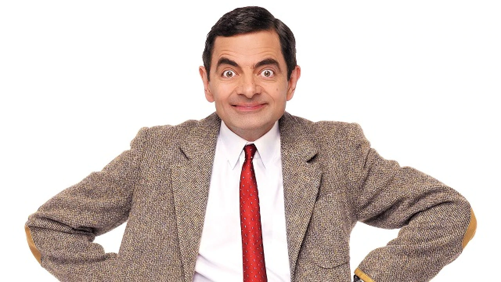
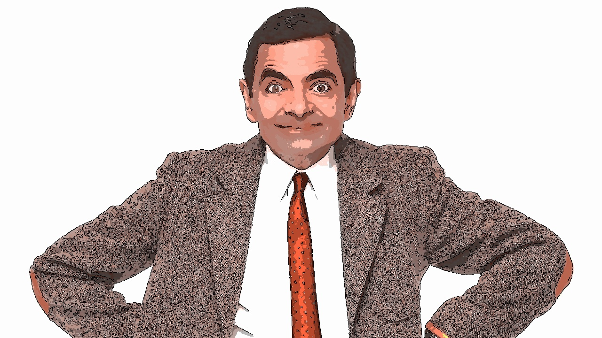

# Cartoonization

A simple tool that can give your pictures a nice cartoonic effect!
This image processing project used some important python libraries, opencv and machine learning model to give images a cartoonish look.

Using OpenCV, the image is smoothened with bilateral filter and transformed to HSV color space. The edges are extracted to superimpose them later. On the other hand, k-means clustering (ML) and histogram equalization accomplishes the task of effectively spreading the most frequent intensity value to give the planar cartoonish spread. Finally, the preserved edges are superimposed to get the cartoonish look.  

## Requirements
```
opencv-python
numpy
scipy
```

## Sample



